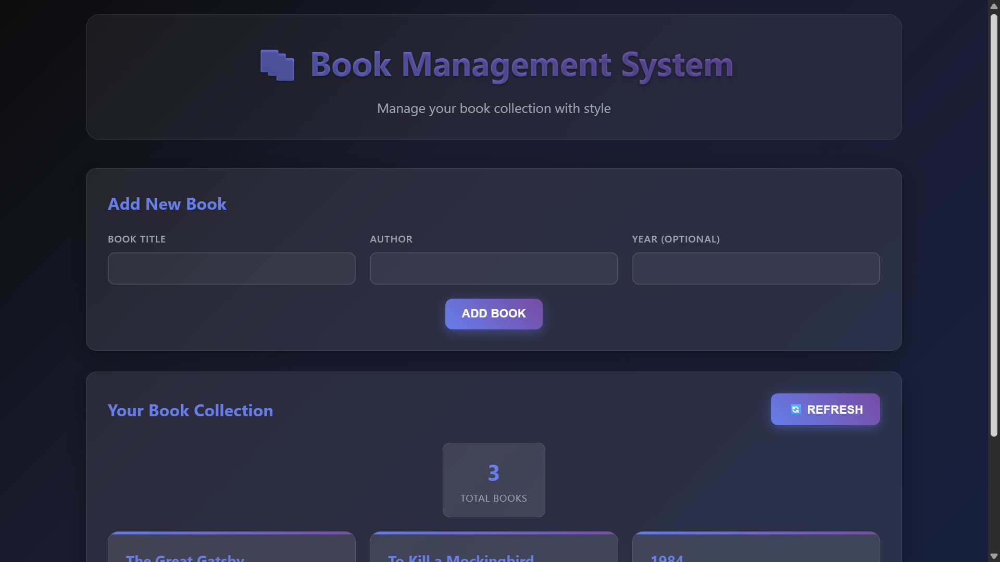
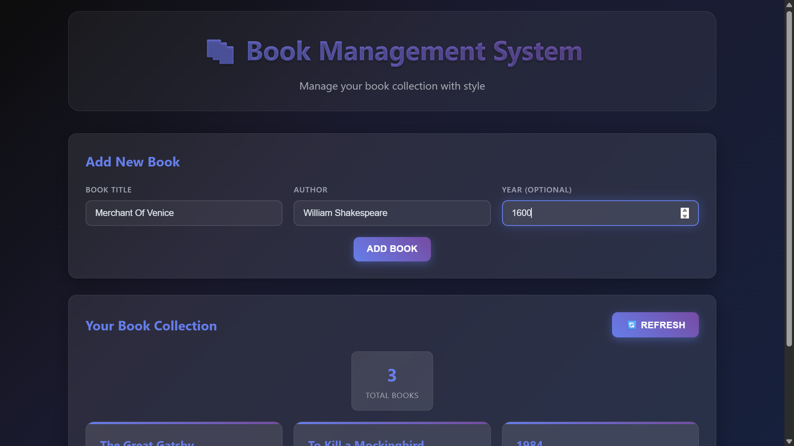
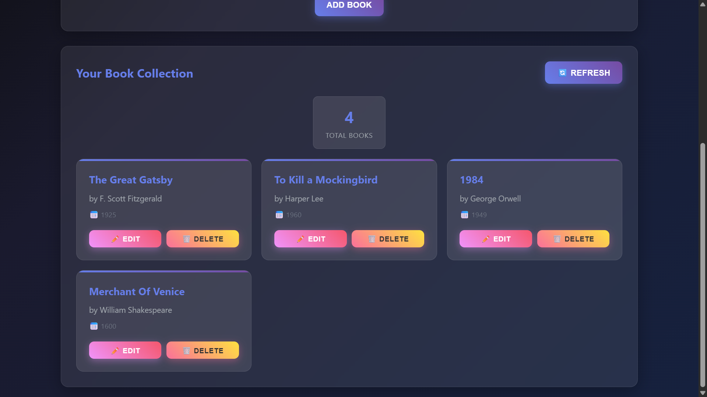
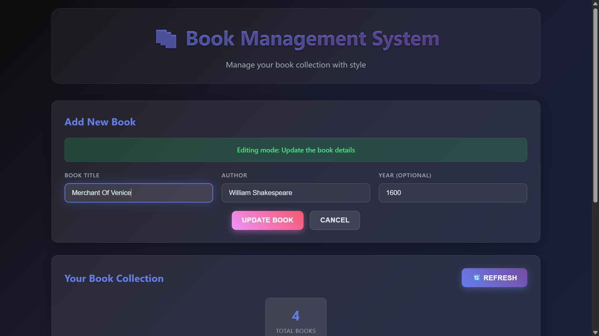
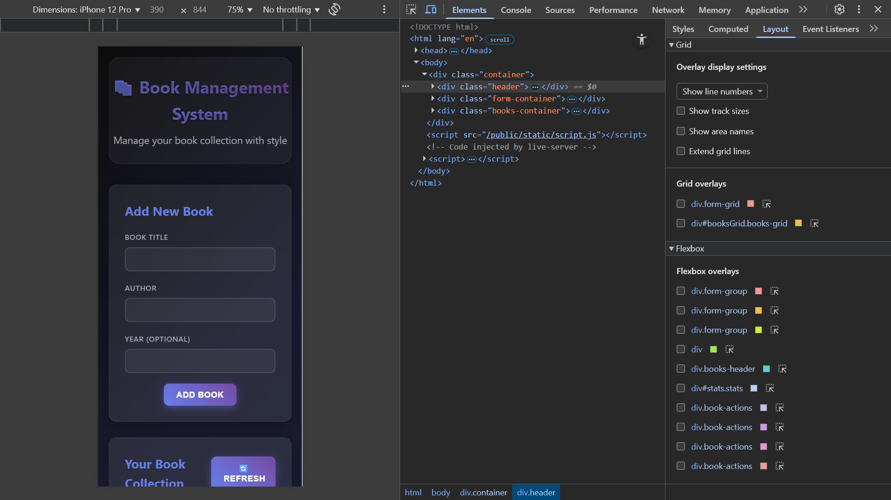

# 📚 Book Management REST API

A modern, full-stack book management system built with Node.js, Express.js, and vanilla JavaScript featuring a beautiful dark-themed UI with glassmorphism design.


## 🌟 Features

- ✅ **Complete CRUD Operations** - Create, Read, Update, Delete books
- ✅ **Beautiful Dark UI** - Modern glassmorphism design with smooth animations
- ✅ **Responsive Design** - Works perfectly on desktop and mobile
- ✅ **Input Validation** - Client and server-side validation
- ✅ **Error Handling** - Comprehensive error handling with user-friendly messages
- ✅ **CORS Support** - Cross-origin resource sharing enabled
- ✅ **Real-time Stats** - Live book count and statistics
- ✅ **RESTful API** - Following REST architectural principles
- ✅ **In-memory Storage** - No database setup required


## 📱 Screenshots

### Main Interface

*Beautiful dark-themed interface with glassmorphism effects*

### Add Book Form

*Intuitive form with real-time validation*

### Book Collection

*Responsive grid layout with hover effects*

### Edit Mode

*Seamless editing experience*

### Mobile View

*Fully responsive mobile interface*

## 🛠️ Tech Stack

- **Backend:** Node.js, Express.js
- **Frontend:** HTML5, CSS3, Vanilla JavaScript
- **Styling:** Modern CSS with Glassmorphism effects
- **Storage:** In-memory (Array-based)

## 📋 API Endpoints

| Method | Endpoint | Description |
|--------|----------|-------------|
| GET | `/books` | Get all books |
| GET | `/books/:id` | Get book by ID |
| POST | `/books` | Create new book |
| PUT | `/books/:id` | Update book by ID |
| DELETE | `/books/:id` | Delete book by ID |

## 🏃‍♂️ Quick Start

### Prerequisites
- Node.js (v14 or higher)
- npm or yarn

### Installation

1. **Clone the repository**
```bash
git clone https://github.com/AdarshXKumAR/Book-Management-Rest-API.git
cd book-management-rest-api
```

2. **Install dependencies**
```bash
npm install
```

3. **Start the server**
```bash
npm start
```

4. **Open your browser**
```
http://localhost:3000
```

### Development Mode
```bash
npm run dev
```
This starts the server with nodemon for auto-restart on file changes.

## 📁 Project Structure

```
book-management-rest-api/
├── server.js              # Main server file
├── package.json           # Dependencies and scripts
├── public/
│   └── index.html        # Frontend interface
├── screenshots/          # Project screenshots
├── README.md            # Project documentation
└── .gitignore          # Git ignore file
```

## 🔧 Configuration

The server runs on port 3000 by default. You can change this by setting the PORT environment variable:

```bash
PORT=5000 npm start
```

## 📊 API Usage Examples

### Create a new book
```bash
curl -X POST http://localhost:3000/books \
  -H "Content-Type: application/json" \
  -d '{
    "title": "The Great Gatsby",
    "author": "F. Scott Fitzgerald",
    "year": 1925
  }'
```

### Get all books
```bash
curl -X GET http://localhost:3000/books
```

### Update a book
```bash
curl -X PUT http://localhost:3000/books/1 \
  -H "Content-Type: application/json" \
  -d '{
    "title": "Animal Farm",
    "author": "George Orwell",
    "year": 1945
  }'
```

### Delete a book
```bash
curl -X DELETE http://localhost:3000/books/1
```

## 🎨 UI Features

- **Glassmorphism Design** - Modern frosted glass effect
- **Smooth Animations** - Hover effects and transitions
- **Dark Theme** - Easy on the eyes
- **Responsive Layout** - Works on all screen sizes
- **Interactive Elements** - Real-time feedback
- **Loading States** - Visual feedback during API calls

## 🔍 Testing

### Using Postman
1. Import the API endpoints
2. Test all CRUD operations
3. Verify response formats and status codes

### Using the Frontend
1. Open http://localhost:3000
2. Use the web interface to test all features
3. Check browser console for any errors

### Manual Testing
- Add books with various data
- Edit existing books
- Delete books
- Test validation errors
- Check responsive design

## 🐛 Error Handling

The API includes comprehensive error handling:

- **400 Bad Request** - Invalid input data
- **404 Not Found** - Resource not found
- **500 Internal Server Error** - Server errors

Example error response:
```json
{
  "error": "Validation Error",
  "message": "Title and author are required fields"
}
```

## 🔒 Security Features

- Input validation and sanitization
- CORS configuration
- Error message sanitization
- XSS prevention

## 📚 Learning Resources

This project demonstrates:
- REST API design principles
- Express.js routing and middleware
- Error handling best practices
- Frontend-backend communication
- Modern CSS techniques
- Responsive web design

## 🤝 Contributing

1. Fork the repository
2. Create a feature branch (`git checkout -b feature/amazing-feature`)
3. Commit your changes (`git commit -m 'Add amazing feature'`)
4. Push to the branch (`git push origin feature/amazing-feature`)
5. Open a Pull Request

## 📝 License

This project is licensed under the MIT License - see the [LICENSE](LICENSE) file for details.

## 🙏 Acknowledgments

- Express.js team for the excellent framework
- Modern CSS techniques inspiration
- REST API design best practices

## 📞 Contact

LinkedIn - [@Abhishek Adarsh](www.linkedin.com/in/abhishekadarsh0670) 

Project Link: [https://github.com/AdarshXKumAR/Book-Management-Rest-API](https://github.com/AdarshXKumAR/Book-Management-Rest-API)

---

⭐ **Don't forget to star this repository if you found it helpful!**
